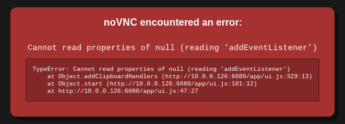

# 環境構築
## yarn install
```bash
$ docker-compose run client yarn install
```

## migrate
```bash
$ docker-compose up -d
$ docker-compose run server go run db/migrate/migrate.go
```

# テスト（Playwright）
## エンド／エントリーポイント編集
```typescript
// client/.env
- REACT_APP_API_URL=http://localhost:8080
+ REACT_APP_API_URL=http://server:8080
```
```Go
// server/router/router.go
- AllowOrigins: []string{"http://localhost:3000", os.Getenv("FE_URL")},
+ AllowOrigins: []string{"http://client:3000", os.Getenv("FE_URL")},
```

## 仮想ディスプレイ起動・アクセス  
```bash
$ docker exec -it playwright bash

> ./start.sh
# -> http://localhost:8010/vnc.html  にアクセスし接続
```

### エラー対処
- "Permission denied"と表示される場合
```bash
> chmod 755 ./start.sh
```

- 接続できない場合
```bash
$ docker-compose down
```

- 画像のエラー  
  
→ キャッシュ削除で解消  

## （コードジェネレーター起動）  
```bash
> npx playwright codegen http://client:3000/todo
```

## テスト実行
```bash
# Create Task
> npx playwright test tests/create-task.spec.ts --headed

# Update Task
> npx playwright test tests/update-task.spec.ts --headed

# Delete Task
> npx playwright test tests/delete-task.spec.ts --headed
```